# Factoring Finance Smart Contracts

A comprehensive smart contract system for factoring finance using USDC/USDT stablecoins. This system enables businesses to factor their accounts receivable (bills) for immediate cash flow while providing investors with opportunities to earn returns.

## � Table of Contents
- [Features](#-features)
- [System Architecture](#-system-architecture)
- [Workflow Diagrams](#-workflow-diagrams)
- [Contract Architecture](#-contract-architecture)
- [Project Structure](#-project-structure)
- [Installation](#-installation)
- [Testing](#-testing)
- [Deployment](#-deployment)
- [Contract Interactions](#-contract-interactions)
- [Security](#-security-considerations)

## �🚀 Features

### Core Functionality
- **Bill Factoring**: Convert accounts receivable into immediate cash
- **Multi-Token Support**: Works with USDC and USDT stablecoins
- **NFT Representation**: Each bill is represented as an ERC721 NFT
- **Liquidity Pools**: Investors can deposit funds to earn returns
- **Automated Distribution**: Smart contract handles all payments and fees
- **Flexible Conditions**: Configurable fee structure per bill via Conditions struct

### Financial Flow
1. **Upfront Payment**: Bill owners receive configurable percentage (default 80%) of bill value immediately
2. **Bill Completion**: When debtor pays the full amount, funds are distributed according to bill conditions:
   - Upfront amount returns to the liquidity pool
   - Configurable percentage goes to the bill owner (default 15%)
   - Configurable percentage retained as platform fees (default 5%)

### Conditions System
Each bill can have custom conditions or use default settings:
- **Default Conditions**: 5% platform fees, 80% upfront payment, 15% to bill owner on completion
- **Custom Conditions**: Can be set per bill for flexible terms
- **Validation**: All percentages must be positive and cannot exceed 100% total

### NFT Transfer Control (via BillNFT)
- **Locked by Default**: All bill NFTs start in a locked state and cannot be transferred
- **Owner-Controlled Unlocking**: Only the contract owner can unlock NFTs for transfer
- **Re-locking Capability**: Contract owner can lock NFTs again at any time
- **No Operator Approvals**: `setApprovalForAll` is completely disabled for security
- **Secure Approval**: Individual NFT approvals only work on unlocked NFTs
- **Modular Implementation**: All NFT logic is contained in the separate BillNFT contract

### Security Features
- **Access Control**: Owner-only functions for critical operations
- **Reentrancy Protection**: Prevents reentrancy attacks
- **Pausable**: Emergency pause functionality
- **SafeERC20**: Secure token transfer operations

## 🏗 System Architecture

### Contract Inheritance & Composition

```mermaid
classDiagram
    class ERC721 {
        <<OpenZeppelin>>
        +ownerOf()
        +transferFrom()
        +approve()
    }
    
    class ReentrancyGuard {
        <<OpenZeppelin>>
        +nonReentrant
    }
    
    class Pausable {
        <<OpenZeppelin>>
        +pause()
        +unpause()
    }
    
    class Authorized {
        <<Privylabs>>
        +onlyOwner
        +onlyAuthorizedAdmin
    }
    
    class BillNFT {
        +_mintBillNFT()
        +getNFTOwner()
        +_update()
    }
    
    class FactoringContract {
        +createBillRequest()
        +createOffer()
        +acceptOffer()
        +completeBill()
        +withdrawOffer()
        +cancelBillRequest()
    }
  # System Constants & Limits

```mermaid
graph LR
    subgraph "FactoringContract Constants"
        C1["BASIS_POINTS<br/>10,000"]
        C2["MAX_FEE_PERCENTAGE<br/>1,000 (10%)"]
        C3["MAX_INTEREST_RATE<br/>5,000 (50%)"]
        C4["MAX_DUE_DATE_DURATION<br/>1,825 days (5 years)"]
        C5["MAX_BILLS_PER_OWNER<br/>1,000"]
    end
    
    subgraph "Default Fees"
        F1["debtorFeePercentage<br/>40 (0.4%)"]
        F2["lenderFeePercentage<br/>10 (0.1%)"]
    end
    
    subgraph "Default Conditions"
        DC1["upfrontPercentage<br/>8,000 (80%)"]
        DC2["rateInterest<br/>200 (2% monthly)"]
    end
    
    subgraph "Time Parameters"
        T1["numberofDaysPerMonth<br/>30 days"]
    end
    
    style C1 fill:#E3F2FD
    style C2 fill:#FFEBEE
    style C3 fill:#FFEBEE
    style C4 fill:#FFF3E0
    style C5 fill:#F3E5F5
    style F1 fill:#E8F5E9
    style F2 fill:#E8F5E9
    style DC1 fill:#FFF9C4
    style DC2 fill:#FFF9C4
    style T1 fill:#E0F2F1
```

##  
    class SimpleFund {
        +deposit()
        +withdraw()
        +createOfferForBillRequest()
        +acceptOfferForOwnedBill()
        +payBillForDebtor()
        +getAvailableBalance()
    }
    
    class Fund {
        +invest()
        +withdraw()
        +createOfferAutomatically()
        +handleBillCompletion()
        +getInvestorValue()
    }
    
    ERC721 <|-- BillNFT
    BillNFT <|-- FactoringContract
    ReentrancyGuard <|-- FactoringContract
    Pausable <|-- FactoringContract
    Authorized <|-- FactoringContract
    
    ReentrancyGuard <|-- SimpleFund
    Pausable <|-- SimpleFund
    Authorized <|-- SimpleFund
    
    ReentrancyGuard <|-- Fund
    Pausable <|-- Fund
    Authorized <|-- Fund
    
    FactoringContract o-- SimpleFund : uses
    FactoringContract o-- Fund : uses
```

### Data Structure Relationships

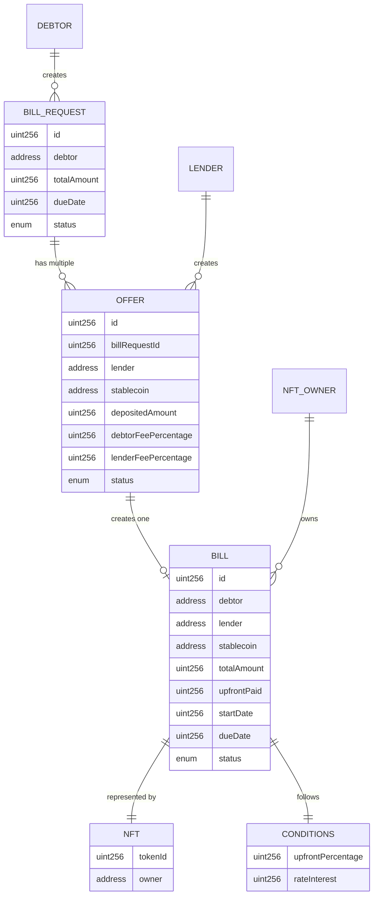

### High-Level Architecture Diagram

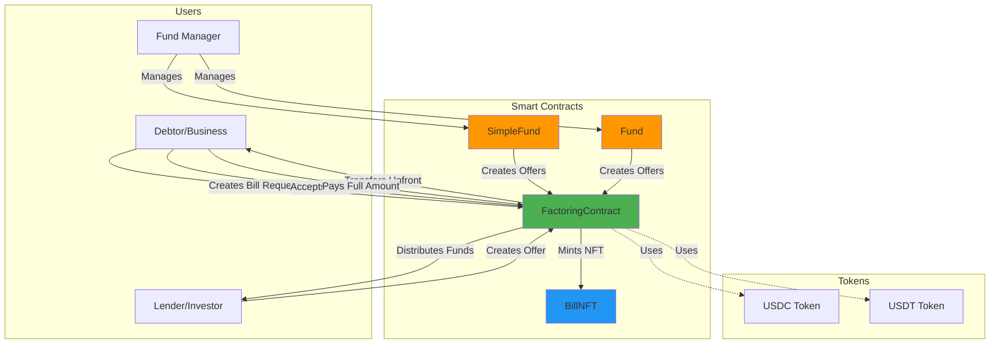

### Component Interaction Flow

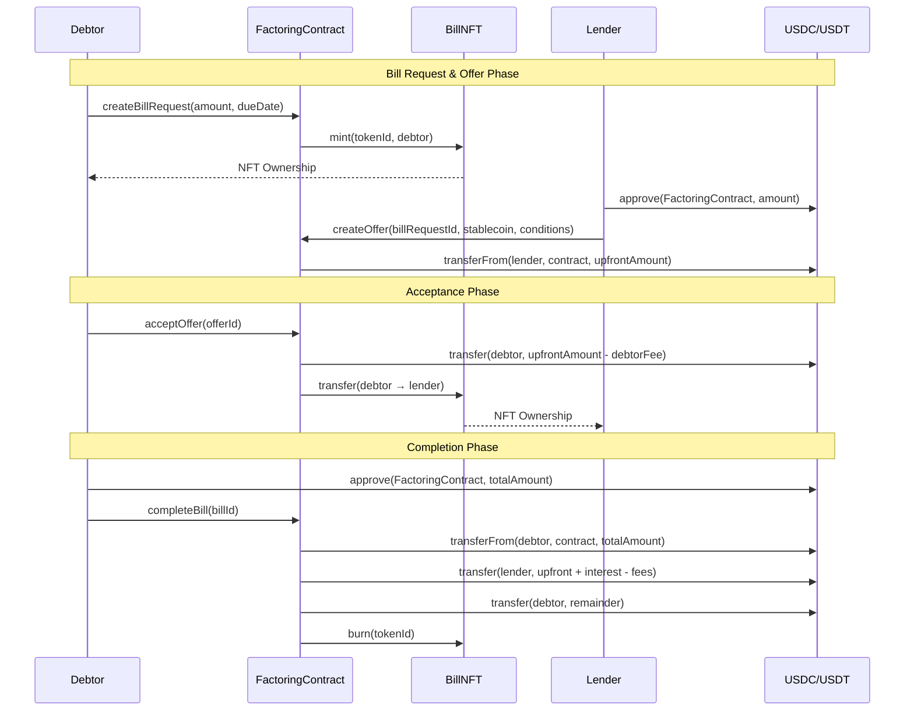

## 📊 Workflow Diagrams

### 1. Bill Lifecycle State Machine

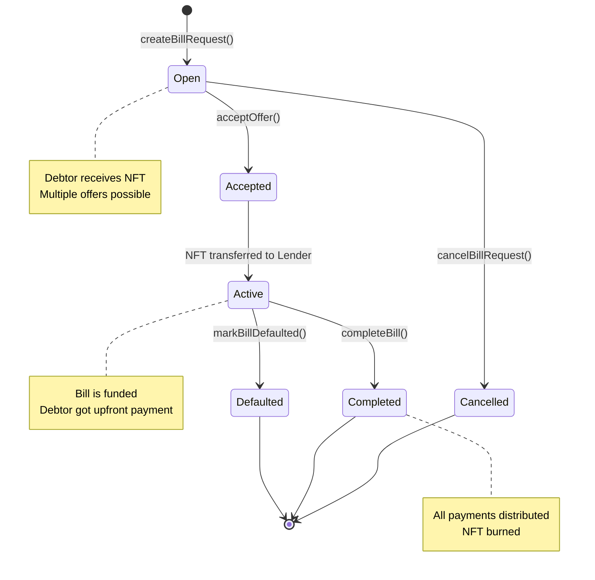

### 2. Offer Lifecycle

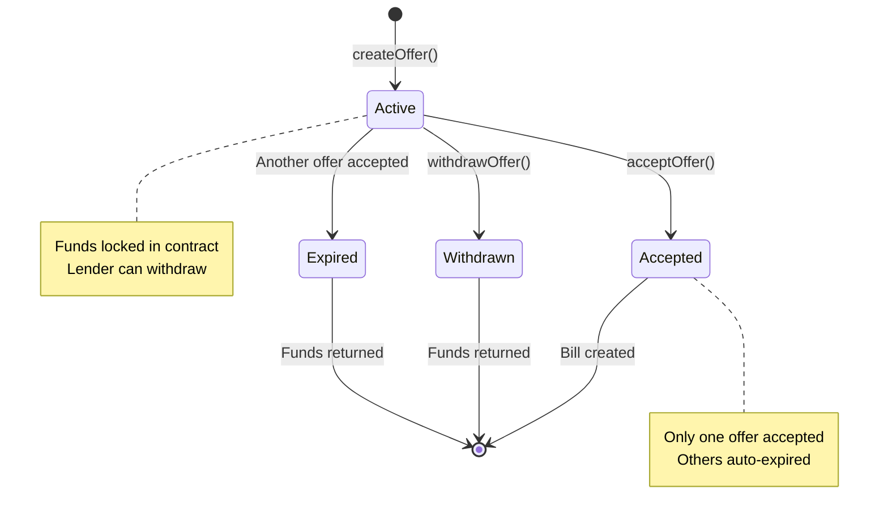

### 3. Complete Bill Payment Flow

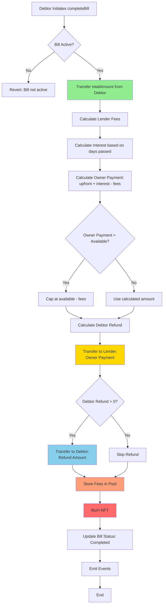

### 4. Interest Calculation Flow

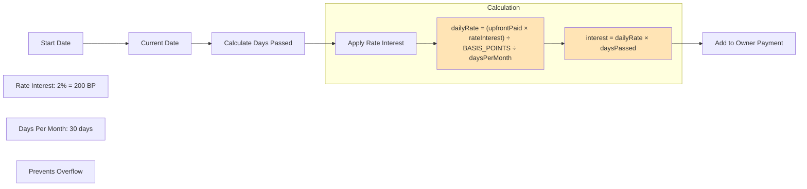

### 5. Fund Contract Interaction

```mermaid
graph TB
    subgraph "SimpleFund Operations"
        SF1[Deposit Funds] --> SF2[Create Bill Request<br/>as Debtor]
        SF2 --> SF3[Create Offer<br/>as Lender]
        SF3 --> SF4[Accept Offer<br/>if Fund owns NFT]
        SF4 --> SF5[Bill Completion]
        SF5 --> SF6[Withdraw Payments]
    end
    
    subgraph "Fund Operations"
        F1[Investors Deposit] --> F2[Pool Funds]
        F2 --> F3[Auto-Create Offers]
        F3 --> F4[Bill Completion]
        F4 --> F5[Distribute Profits<br/>to Investors]
        F5 --> F6[Collect Management Fees]
    end
    
    subgraph "Committed Funds Tracking"
        T1[Available Balance] --> T2{Create Offer?}
        T2 -->|Yes| T3[Lock Committed Funds]
        T3 --> T4{Offer Accepted?}
        T4 -->|Yes| T5[Keep Locked]
        T4 -->|No| T6[Release Funds]
        T5 --> T7[Bill Complete]
        T7 --> T8[Release Funds]
    end
    
    style SF2 fill:#FFE4B5
    style SF3 fill:#90EE90
    style F3 fill:#90EE90
    style T3 fill:#FFB6C1
    style T6 fill:#87CEEB
    style T8 fill:#87CEEB
```

### 6. Security & Validation Flow

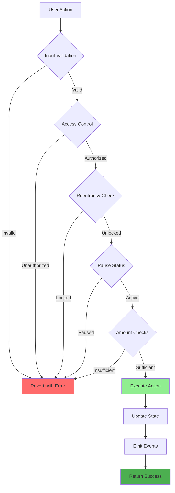

## 🏗 Contract Architecture

The system is built with a modular architecture for better code organization and reusability:

### BillNFT.sol
A standalone NFT contract that handles all ERC721 functionality and transfer controls:
- **ERC721 Implementation**: Standard NFT functionality for bill representation
- **Transfer Control System**: NFTs are locked by default, only contract owner can unlock
- **Security Features**: No operator approvals allowed, individual approvals only on unlocked NFTs
- **Modular Design**: Can be inherited by other contracts or used independently
- **Events**: Emits `NFTUnlocked` and `NFTLocked` events for transparency

### FactoringContract.sol  
The main business logic contract that inherits from BillNFT:
- **Factoring Logic**: Bill creation, funding, and completion workflows
- **Pool Management**: Investor deposits and withdrawals
- **Payment Distribution**: Automated fund allocation according to bill conditions
- **Business Rules**: Default and custom conditions for flexible terms
- **Integration**: Uses BillNFT for all NFT-related operations

### Fund.sol
A comprehensive fund contract that acts as both lender and debtor intermediary:
- **Multi-Investor Support**: Pools funds from multiple investors
- **Automated Offers**: Creates competitive offers for bill requests automatically
- **Profit Sharing**: Distributes profits proportionally among fund participants
- **Bill Management**: Manages debtor bill requests and payments
- **Access Control**: Authorized admin functions for fund management

### SimpleFund.sol
A simplified solo investor version of the Fund contract:
- **Solo Investor Model**: No multiple investors to manage
- **Authorized Access**: Only authorized wallets can deposit/withdraw funds
- **Automated Operations**: Automatic bill request and offer creation
- **Management Fees**: Collects and manages fees for the contract owner
- **Streamlined Design**: Simpler architecture without investor complexity

### Benefits of Modular Design
- **Separation of Concerns**: NFT logic separated from business logic
- **Reusability**: BillNFT can be used in other projects
- **Maintainability**: Easier to update and audit individual components
- **Testability**: Each contract can be tested independently
- **Gas Efficiency**: Optimized inheritance structure
- **Flexibility**: Choose between Fund (multi-investor) or SimpleFund (solo investor)

## 📁 Project Structure

```
contracts/
├── FactoringContract.sol    # Main factoring contract (inherits from BillNFT)
├── BillNFT.sol             # Modular NFT contract with transfer controls
├── Fund.sol                # Multi-investor pooled fund contract
├── SimpleFund.sol          # Solo investor fund contract
├── MockUSDC.sol            # Mock USDC for testing
├── MockUSDT.sol            # Mock USDT for testing
└── Lock.sol                # Default Hardhat contract

test/
├── FactoringContract.test.ts # Core contract tests
├── Fund.test.ts              # Multi-investor fund tests
├── SimpleFund.test.ts        # Solo investor fund tests
└── Lock.ts                   # Default Hardhat test

ignition/
└── modules/
    ├── MockUSDCModule.ts     # Mock USDC token deployment
    ├── MockUSDTModule.ts     # Mock USDT token deployment
    ├── FactoringModule.ts    # Core factoring marketplace deployment
    ├── SimpleFundModule.ts   # Solo investor fund deployment
    └── FundModule.ts         # Multi-investor fund deployment
```

## 🛠 Installation

1. **Clone the repository**
   ```bash
   git clone <repository-url>
   cd factoring
   ```

2. **Install dependencies**
   ```bash
   npm install
   ```

3. **Compile contracts**
   ```bash
   npx hardhat compile
   ```

## 🚀 Demo Scripts

### Basic Factoring Demo
```bash
npx hardhat run scripts/demo.ts
```

### NFT Lock/Unlock Demo
```bash
npx hardhat run scripts/nft-lock-demo.ts
```

This demo showcases:
- NFT lock/unlock functionality
- Transfer restrictions and security measures
- Payment routing to current NFT owner
- Contract owner controls

## 🧪 Testing

Run the comprehensive test suite:
```bash
npx hardhat test
```

The test suite includes:
- Contract deployment and initialization
- Pool management (deposits/withdrawals)
- Bill creation and NFT minting
- Bill funding and completion
- Edge cases and security tests
- Multi-token support verification

## 🚀 Deployment

The project uses Hardhat Ignition modules organized for different deployment environments:

### Structure
```
ignition/
├── modules/
│   ├── mainnet/           # Production deployment (real USDC/USDT)
│   │   ├── FactoringModule.ts
│   │   ├── SimpleFundModule.ts
│   │   ├── FundModule.ts
│   │   └── DeployAllModule.ts
│   └── testnet/           # Testing deployment (mock tokens)
│       ├── FactoringModule.ts
│       ├── SimpleFundModule.ts
│       ├── FundModule.ts
│       ├── MockUSDCModule.ts
│       └── MockUSDTModule.ts
├── parameters/
│   ├── mainnet.json       # Real token addresses
│   ├── mainnet-deploy-all.json
│   └── testnet.json       # Empty (uses mock tokens)
└── README.md              # Detailed deployment docs
```

### Quick Deploy

Use the deployment script:
```bash
# Deploy all contracts to testnet
./scripts/deploy.sh sepolia all

# Deploy specific contract to mainnet (requires confirmation)
./scripts/deploy.sh mainnet factoring

# Deploy SimpleFund to local network
./scripts/deploy.sh localhost simplefund
```

### Manual Deployment

**Testnet (with mock tokens):**
```bash
npx hardhat ignition deploy ignition/modules/testnet/FactoringModule.ts --network sepolia --parameters ignition/parameters/testnet.json
```

**Mainnet (with real USDC/USDT):**
```bash
npx hardhat ignition deploy ignition/modules/mainnet/DeployAllModule.ts --network mainnet --parameters ignition/parameters/mainnet-deploy-all.json
```

### Token Addresses

**Mainnet:**
- USDC: `0xA0b86a33E6441b8435b662F21e9A1e01e13D52A3`
- USDT: `0xdAC17F958D2ee523a2206206994597C13D831ec7`

**Testnet:** Mock tokens deployed automatically

See [ignition/README.md](ignition/README.md) for complete deployment documentation.

## 🚀 Legacy Deployment (Deprecated)

The project includes three independent Hardhat Ignition modules for different deployment scenarios:

### Available Deployment Modules

1. **FactoringModule** - Core factoring contract with mock tokens
2. **SimpleFundModule** - Solo investor fund with auto-offer functionality  
3. **FundModule** - Multi-investor pooled fund

### Quick Deploy Commands

```bash
# Deploy core factoring contract only
npm run deploy:factoring:local

# Deploy simple fund (solo investor)
npm run deploy:simple-fund:local

# Deploy multi-investor fund
npm run deploy:fund:local
```

### Using the Deployment Helper Script

```bash
# Interactive deployment helper
npm run deploy-ignition

# Deploy specific modules
npm run deploy-ignition factoring localhost
npm run deploy-ignition simple-fund localhost
npm run deploy-ignition fund localhost
```

### Manual Hardhat Ignition Deployment

```bash
# Start local network
npx hardhat node

# Deploy FactoringContract + MockTokens
npx hardhat ignition deploy ./ignition/modules/FactoringModule.ts --network localhost

# Deploy SimpleFund + Dependencies
npx hardhat ignition deploy ./ignition/modules/SimpleFundModule.ts --network localhost

# Deploy Fund + Dependencies
npx hardhat ignition deploy ./ignition/modules/FundModule.ts --network localhost
```

### Testnet Deployment

```bash
# Deploy to Sepolia testnet
npx hardhat ignition deploy ./ignition/modules/FactoringModule.ts --network sepolia
npx hardhat ignition deploy ./ignition/modules/SimpleFundModule.ts --network sepolia
npx hardhat ignition deploy ./ignition/modules/FundModule.ts --network sepolia
```

### Module Configurations

#### FactoringModule
- **MockUSDC**: 6 decimals, deployer as owner
- **MockUSDT**: 6 decimals, deployer as owner  
- **FactoringContract**: Core marketplace contract

#### SimpleFundModule
- **All of FactoringModule** +
- **SimpleFund**: Solo investor fund with auto-offering
  - Management fee: 5%
  - Bill terms: 3% fee, 80% upfront, 17% on completion
  - Amount limits: $1K - $50K

#### FundModule  
- **All of FactoringModule** +
- **Fund**: Multi-investor pooled fund
  - Investment range: $5K - $100K per investor
  - Target fund size: $1M
  - Management fee: 2%
  - Bill terms: 4% fee, 80% upfront, 16% on completion
  - Amount limits: $2K - $100K

## 📊 Contract Interactions

### Interaction Overview

```mermaid
graph TB
    subgraph "Phase 1: Bill Request Creation"
        A1[Debtor] -->|1. createBillRequest| FC1[FactoringContract]
        FC1 -->|2. Mint NFT| A1
        FC1 -->|3. Store Request| DB1[(BillRequest Storage)]
    end
    
    subgraph "Phase 2: Offer Creation"
        L1[Lender] -->|1. Approve Tokens| TOKEN1[USDC/USDT]
        L1 -->|2. createOffer| FC2[FactoringContract]
        FC2 -->|3. Lock Funds| TOKEN1
        FC2 -->|4. Store Offer| DB2[(Offer Storage)]
    end
    
    subgraph "Phase 3: Offer Acceptance"
        A2[Debtor/NFT Owner] -->|1. acceptOffer| FC3[FactoringContract]
        FC3 -->|2. Transfer Upfront - Fees| A2
        FC3 -->|3. Transfer NFT| L2[Lender]
        FC3 -->|4. Store Fees| POOL1[Fee Pool]
        FC3 -->|5. Refund Other Offers| L3[Other Lenders]
        FC3 -->|6. Create Bill| DB3[(Bill Storage)]
    end
    
    subgraph "Phase 4: Bill Completion"
        A3[Debtor] -->|1. Approve Total Amount| TOKEN2[USDC/USDT]
        A3 -->|2. completeBill| FC4[FactoringContract]
        FC4 -->|3. Calculate Interest| CALC[Interest Calculator]
        FC4 -->|4. Pay Lender| L4[Current NFT Owner]
        FC4 -->|5. Refund Debtor| A3
        FC4 -->|6. Store Fees| POOL2[Fee Pool]
        FC4 -->|7. Burn NFT| NFT1[NFT Contract]
        FC4 -->|8. Update Status| DB4[(Bill Storage)]
    end
    
    style A1 fill:#FFE4B5
    style L1 fill:#90EE90
    style A2 fill:#FFE4B5
    style L2 fill:#90EE90
    style A3 fill:#FFE4B5
    style L4 fill:#90EE90
    style POOL1 fill:#FFA07A
    style POOL2 fill:#FFA07A
```

### For Investors
1. **Deposit to Pool**
   ```solidity
   factoringContract.depositToPool(amount, tokenAddress);
   ```

2. **Withdraw from Pool** (Owner only)
   ```solidity
   factoringContract.withdrawFromPool(amount, tokenAddress);
   ```

### For Bill Owners
1. **Create Bill with Default Conditions**
   ```solidity
   factoringContract.createBill(totalAmount, dueDate, tokenAddress, description);
   ```

2. **Create Bill with Custom Conditions**
   ```solidity
   Conditions memory customConditions = Conditions({
     feePercentage: 3,      // 3% platform fee
     upfrontPercentage: 90, // 90% upfront payment
     ownerPercentage: 7     // 7% to owner on completion
   });
   
   factoringContract.createBillWithConditions(
     totalAmount, dueDate, tokenAddress, description, customConditions
   );
   ```

3. **Receive NFT**: Automatically minted upon bill creation

### For Contract Owner
1. **Set Default Conditions**
   ```solidity
   factoringContract.setDefaultConditions(feePercentage, upfrontPercentage, ownerPercentage);
   ```

2. **Fund Bill** (Pay upfront percentage)
   ```solidity
   factoringContract.fundBill(billId);
   ```

3. **NFT Lock/Unlock Controls** (inherited from BillNFT)
   ```solidity
   factoringContract.unlockNFT(billId);  // Allow NFT transfers
   factoringContract.lockNFT(billId);    // Prevent NFT transfers
   factoringContract.isNFTUnlocked(billId); // Check lock status
   ```

4. **Emergency Controls**
   ```solidity
   factoringContract.pause();
   factoringContract.unpause();
   ```

### For NFT Holders
1. **Check NFT Lock Status**
   ```solidity
   bool isUnlocked = factoringContract.isNFTUnlocked(billId);
   ```

2. **Transfer Unlocked NFT**
   ```solidity
   // Only works if NFT is unlocked by contract owner
   factoringContract.transferFrom(from, to, billId);
   ```

3. **Approve Unlocked NFT**
   ```solidity
   // Only works if NFT is unlocked
   factoringContract.approve(spender, billId);
   ```

4. **Get NFT Owner**
   ```solidity
   address owner = factoringContract.ownerOf(billId);
   // Or use the convenience function
   address owner = factoringContract.getBillNFTOwner(billId);
   ```

### For Debtors
1. **Complete Bill Payment**
   ```solidity
   factoringContract.completeBill(billId);
   ```

## 🔧 Configuration

### Environment Variables
Create a `.env` file:
```
PRIVATE_KEY=your_private_key_here
INFURA_API_KEY=your_infura_key_here
ETHERSCAN_API_KEY=your_etherscan_key_here
```

### Network Configuration
Update `hardhat.config.ts` for your target networks.

## 📈 Gas Optimization

The contracts are optimized for gas efficiency:
- **FactoringContract**: ~5.0M gas for deployment
- **depositToPool**: ~107K gas average
- **createBill**: ~378K gas average
- **createBillWithConditions**: ~380K gas average
- **fundBill**: ~106K gas average
- **completeBill**: ~90K gas average
- **setDefaultConditions**: ~42K gas average

## 🔐 Security Considerations

### Security Architecture

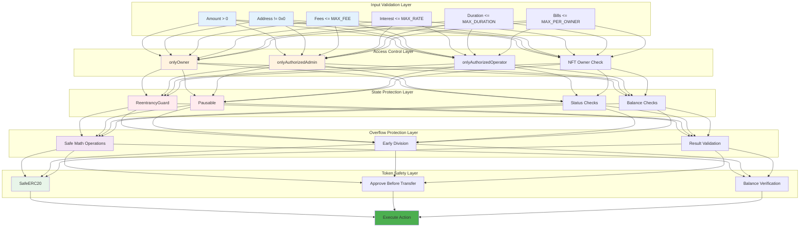

### Fee Calculation & Distribution

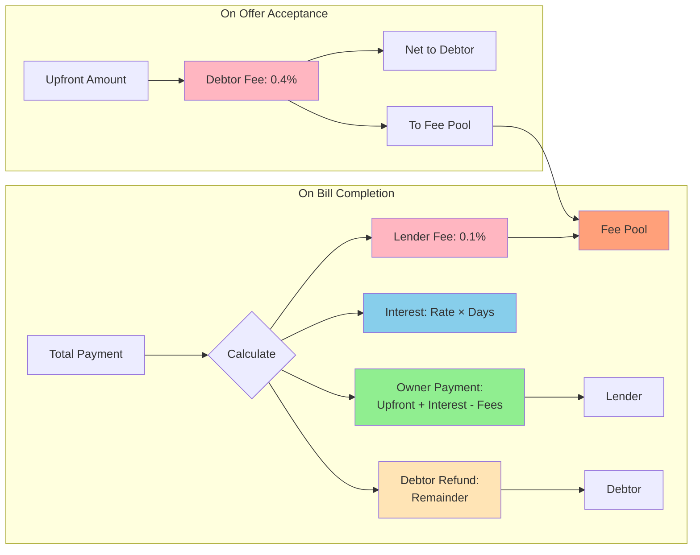

### Implemented Security Measures
- **ReentrancyGuard**: Prevents reentrancy attacks
- **Pausable**: Emergency stop functionality
- **Ownable**: Proper access control
- **SafeERC20**: Secure token operations
- **NFT Lock/Unlock Controls**: Contract owner can control NFT transferability
- **No Operator Approvals**: `setApprovalForAll` completely disabled
- **Locked by Default**: All bill NFTs start locked and require owner permission to transfer

### Audit Recommendations
- Conduct professional security audit before mainnet deployment
- Implement multi-signature wallet for owner functions
- Consider timelock for critical parameter changes
- Regular security monitoring and updates

## 🤝 Contributing

1. Fork the repository
2. Create a feature branch
3. Write comprehensive tests
4. Ensure all tests pass
5. Submit a pull request

## 📜 License

This project is licensed under the MIT License.

## 🆘 Support

For support and questions:
- Create an issue in the repository
- Review the test files for usage examples
- Check the contract documentation

---

**⚠️ Disclaimer**: This is experimental software. Use at your own risk. Conduct thorough testing and auditing before deploying to mainnet.

## 📚 Additional Documentation

### Comprehensive Guides

- **[Architecture Documentation](docs/ARCHITECTURE.md)** - Deep dive into system design, data flows, and technical decisions
  - System overview and design principles
  - Contract hierarchy and relationships
  - Data flow diagrams
  - State management patterns
  - Security model
  - Gas optimization strategies

- **[Deployment Guide](docs/DEPLOYMENT_GUIDE.md)** - Complete deployment instructions for all environments
  - Pre-deployment checklist
  - Network configurations
  - Deployment strategies
  - Post-deployment verification
  - Monitoring and maintenance
  - Troubleshooting

- **[Improvements Applied](IMPROVEMENTS_APPLIED.md)** - Recent security enhancements and fixes
  - Critical security fixes
  - Overflow protection
  - Fee validation
  - Balance tracking improvements

### Quick Reference

| Topic | File | Description |
|-------|------|-------------|
| Contract APIs | `contracts/*.sol` | NatSpec documented functions |
| Tests | `test/*.test.ts` | Usage examples and edge cases |
| Deployment Modules | `ignition/modules/` | Hardhat Ignition configurations |
| Deployment Docs | `ignition/README.md` | Module-specific deployment |

### Visual Documentation

This README includes comprehensive mermaid diagrams for:
- ✅ System architecture
- ✅ Bill lifecycle flow
- ✅ Offer lifecycle
- ✅ Interest calculation
- ✅ Security validation layers
- ✅ Fee distribution
- ✅ Fund operations

### Getting Help

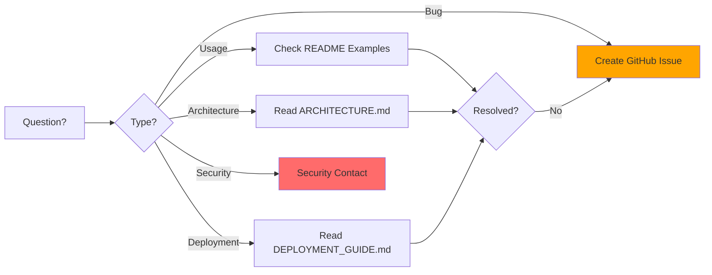

For support:
1. 📖 Check the relevant documentation file
2. 🔍 Review test files for examples
3. 🐛 Create an issue for bugs
4. 🔒 Email security concerns privately

---

**Built with ❤️ for the DeFi community**
