# Architecture Documentation

This document provides an in-depth look at the Factoring Finance Smart Contract system architecture, design decisions, and implementation details.

## Table of Contents
- [System Overview](#system-overview)
- [Design Principles](#design-principles)
- [Contract Hierarchy](#contract-hierarchy)
- [Data Flow](#data-flow)
- [State Management](#state-management)
- [Security Model](#security-model)
- [Gas Optimization](#gas-optimization)

## System Overview

### Core Components

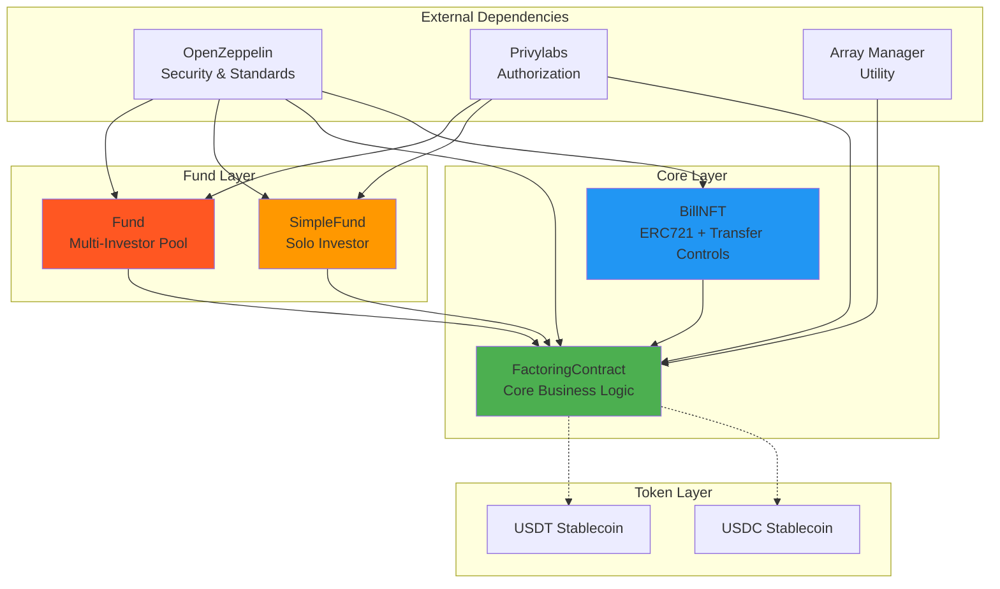

### Three-Tier Architecture

The system follows a three-tier architecture pattern:

1. **Presentation Layer** (User Interaction)
   - Debtors create bill requests
   - Lenders create and manage offers
   - Fund managers operate pooled funds

2. **Business Logic Layer** (Smart Contracts)
   - FactoringContract: Core marketplace logic
   - SimpleFund/Fund: Investment management
   - BillNFT: NFT representation and controls

3. **Data Layer** (Blockchain State)
   - Bill requests and offers
   - Bill lifecycle and history
   - NFT ownership records
   - Fee pools and balances

## Design Principles

### 1. Separation of Concerns

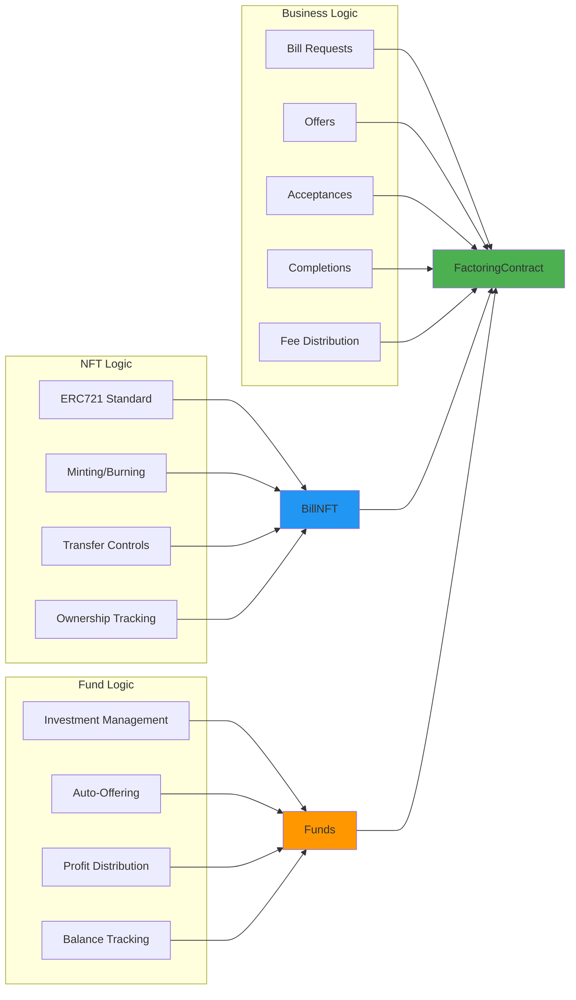

**Benefits:**
- Each contract has a single, well-defined responsibility
- Easier to test, maintain, and upgrade
- Reduces contract size and deployment costs
- Enables independent auditing of components

### 2. Fail-Safe Defaults

All critical operations are protected with multiple validation layers:

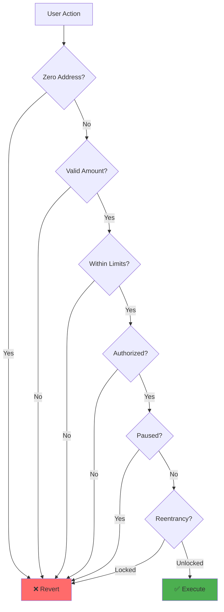

### 3. Progressive Disclosure

The system reveals complexity gradually:

- **Simple Use Case**: Direct debtor-lender interaction
- **Intermediate**: Using SimpleFund for solo investing
- **Advanced**: Multi-investor Fund with automatic strategies

### 4. Defense in Depth

Multiple layers of security:

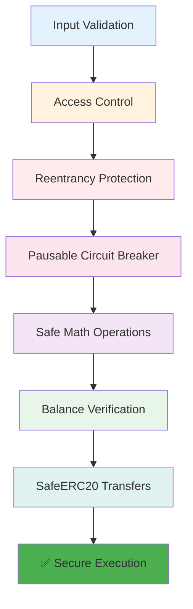

## Contract Hierarchy

### Inheritance Tree

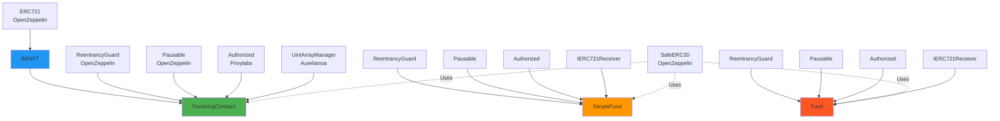

### Interface Compliance

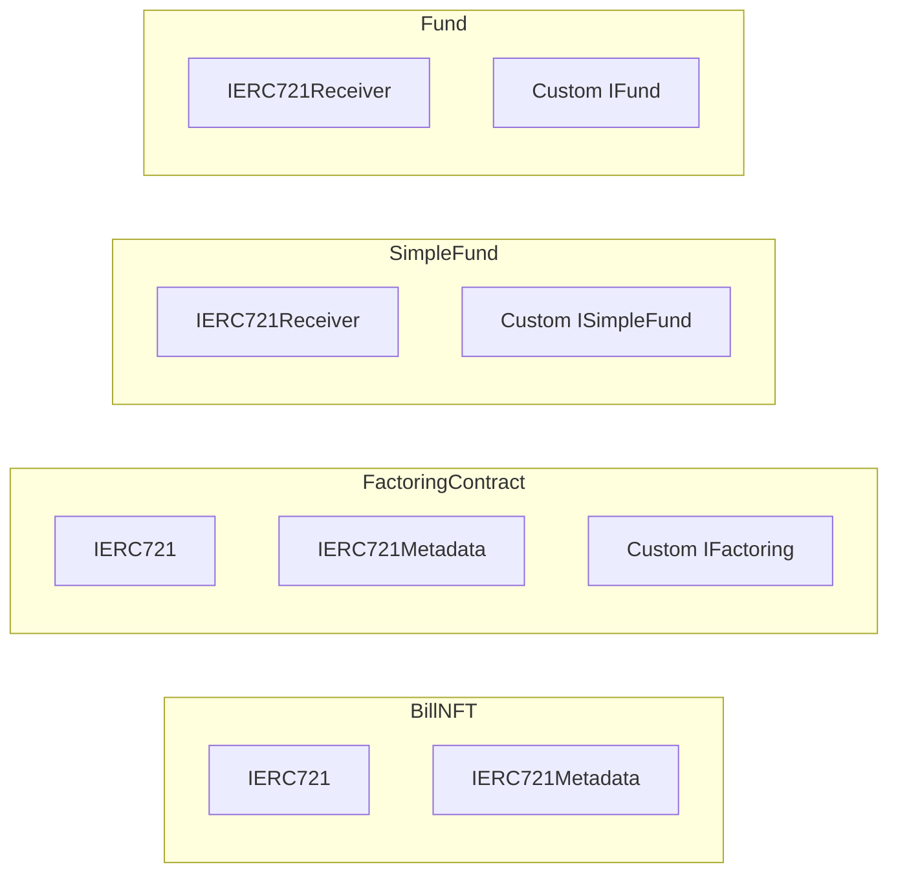

## Data Flow

### Bill Request to Completion

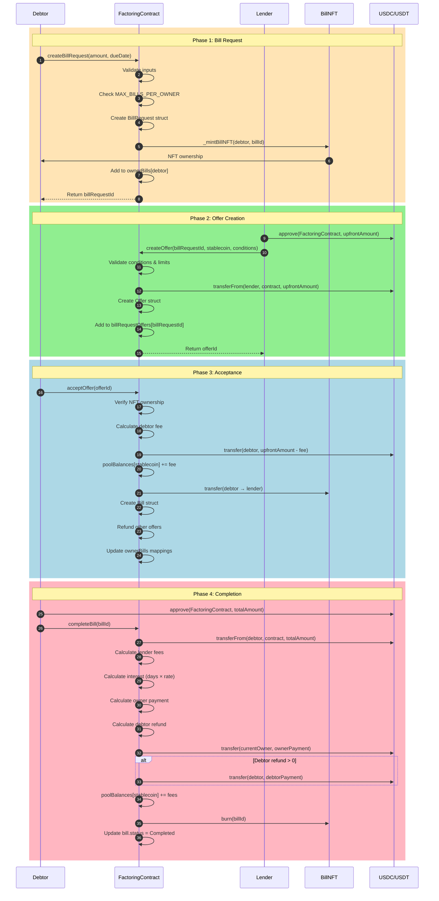

### Fund Operations Flow

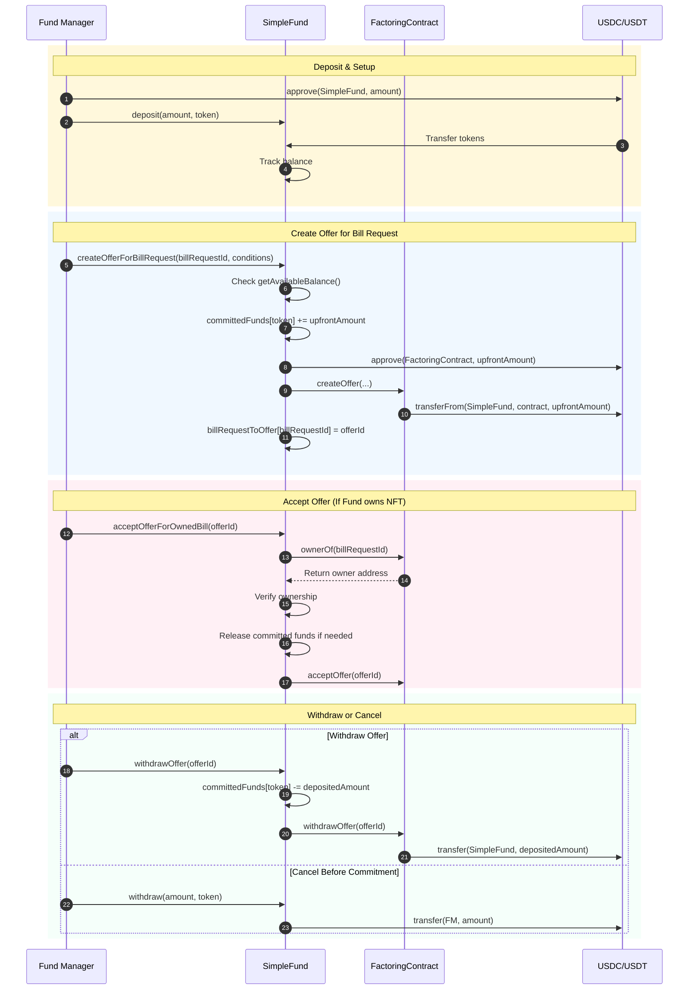

## State Management

### Bill Request States

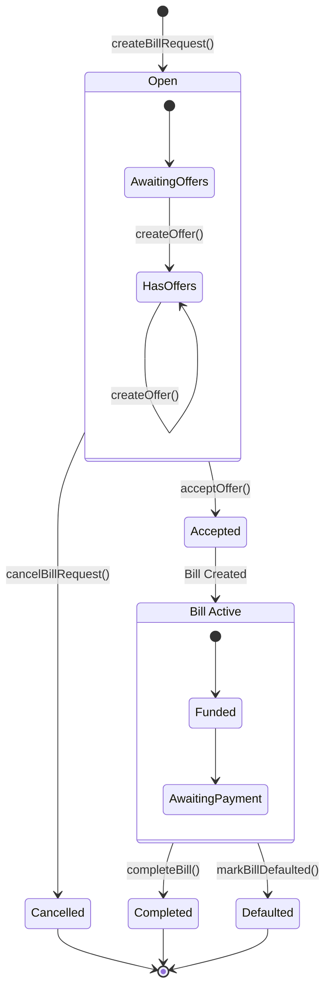

### Offer States

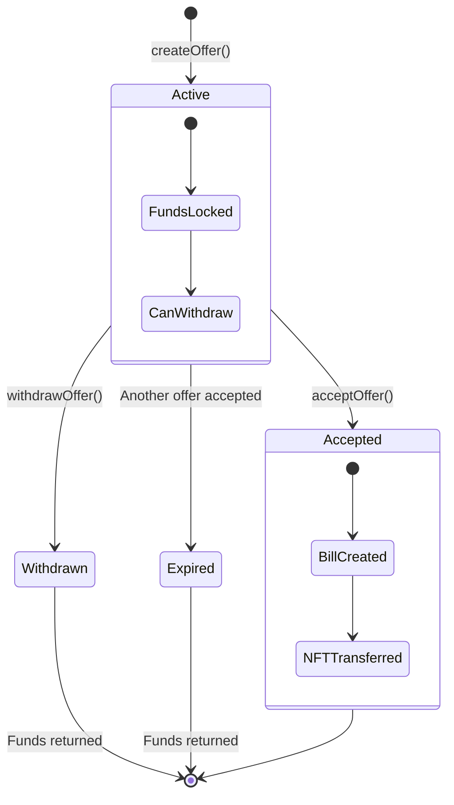

### Fund Balance States

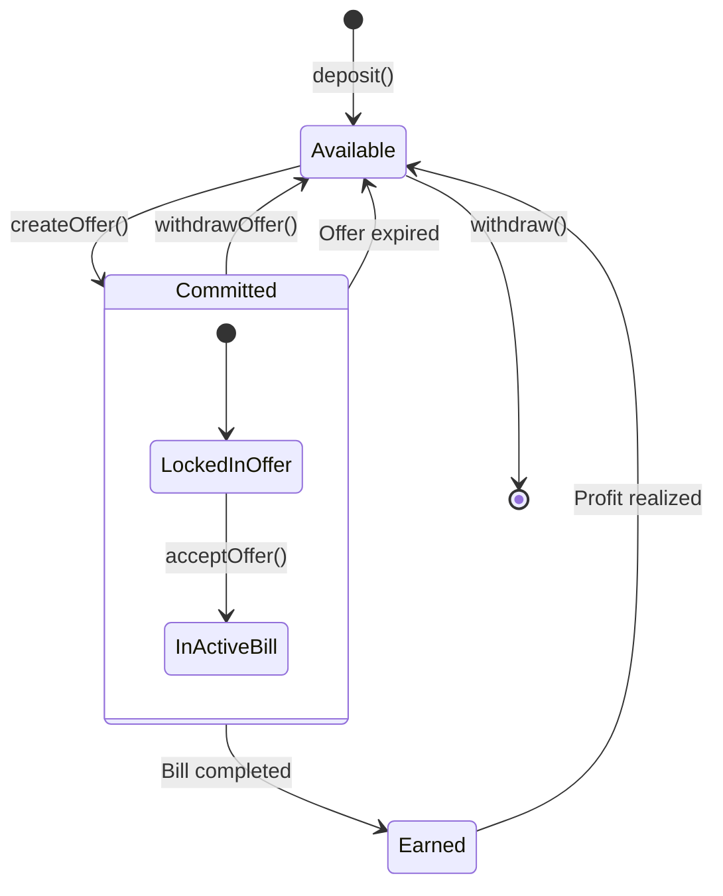

## Security Model

### Multi-Layer Validation

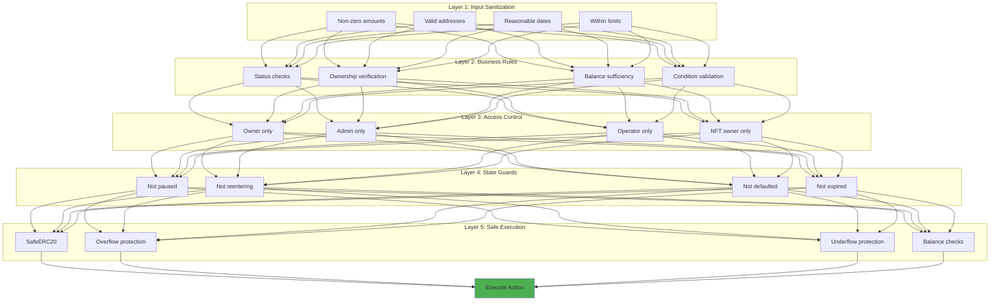

### Reentrancy Protection Pattern

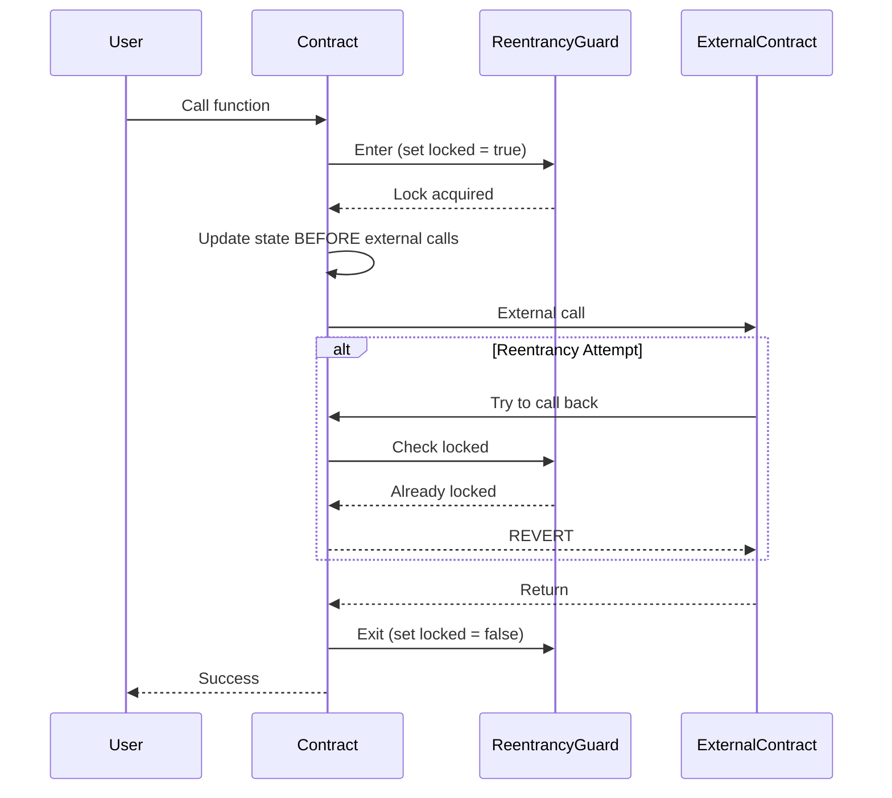

### Pausable Circuit Breaker

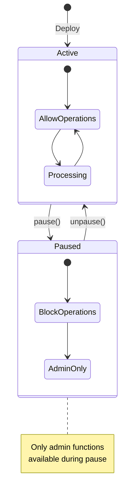

## Gas Optimization

### Storage Optimization

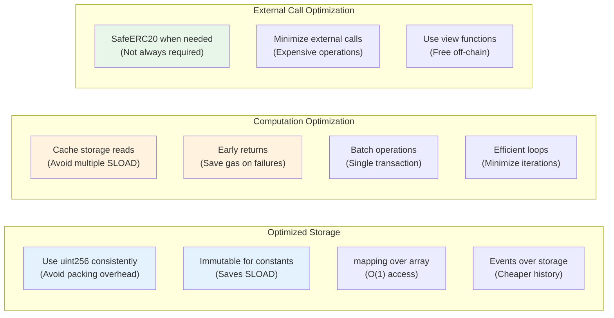

### Interest Calculation Optimization

The interest calculation was specifically optimized to prevent overflow while maintaining precision:

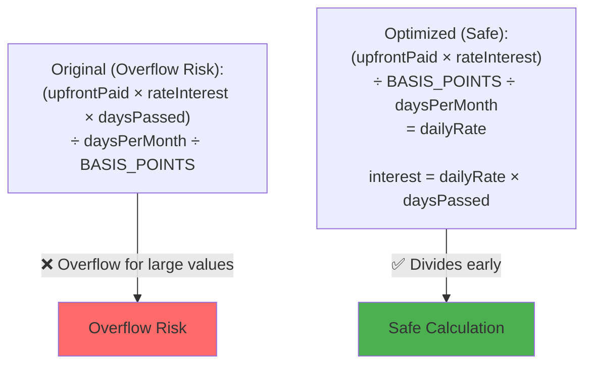

**Why this works:**
1. Divides by BASIS_POINTS (10,000) early, reducing magnitude
2. Divides by daysPerMonth (30) early, further reducing magnitude
3. Final multiplication by daysPassed has much smaller values
4. Prevents overflow for reasonable bill amounts (<10^15) and durations (<5 years)

### Array Management Optimization

```mermaid
graph LR
    subgraph "Array Operations"
        A1[Add: O(1)]
        A2[Remove: O(n)]
        A3[Search: O(n)]
    end
    
    subgraph "Mitigation"
        M1["MAX_BILLS_PER_OWNER = 1000<br/>(Limit array size)"]
        M2["Use for history only<br/>(Not for validation)"]
        M3["Consider EnumerableSet<br/>(For future upgrade)"]
    end
    
    A1 & A2 & A3 --> M1 & M2 & M3
    
    style M1 fill:#FFF3E0
```

## Upgrade Considerations

### Current Architecture (Non-Upgradeable)

The contracts are currently deployed without upgradeability proxies. This design choice prioritizes:
- **Simplicity**: No proxy complexity
- **Gas Efficiency**: No delegatecall overhead
- **Transparency**: Code is what you see
- **Immutability**: Trust through unchangeability

### Future Upgrade Path

If upgradeability is needed, consider:

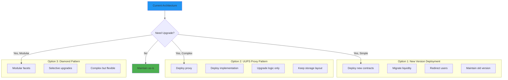

## Conclusion

The Factoring Finance smart contract system is designed with:
- **Security First**: Multiple validation layers and fail-safe defaults
- **Modularity**: Clear separation of concerns
- **Extensibility**: Easy to add new fund types or features
- **Gas Efficiency**: Optimized storage and computation patterns
- **Developer Experience**: Clear interfaces and comprehensive documentation

This architecture balances complexity with usability, providing a robust foundation for factoring finance operations on the blockchain.
