# Deployment Guide

Comprehensive guide for deploying the Factoring Finance smart contracts to various networks.

## Table of Contents
- [Deployment Overview](#deployment-overview)
- [Pre-Deployment Checklist](#pre-deployment-checklist)
- [Network Configurations](#network-configurations)
- [Deployment Strategies](#deployment-strategies)
- [Post-Deployment Verification](#post-deployment-verification)
- [Troubleshooting](#troubleshooting)

## Deployment Overview

### Deployment Flow

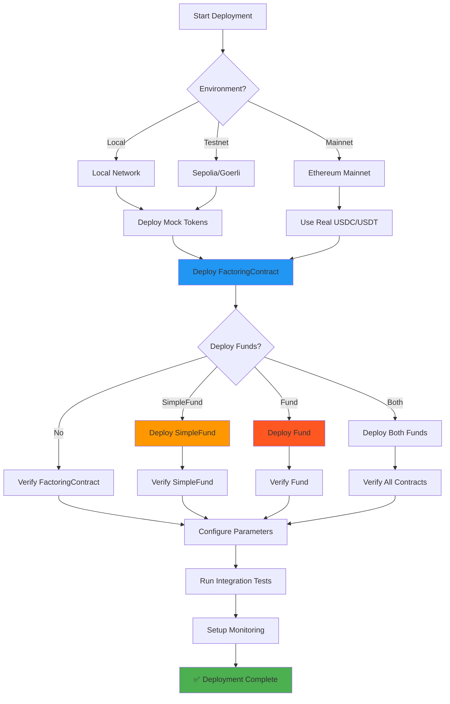

### Contract Dependencies

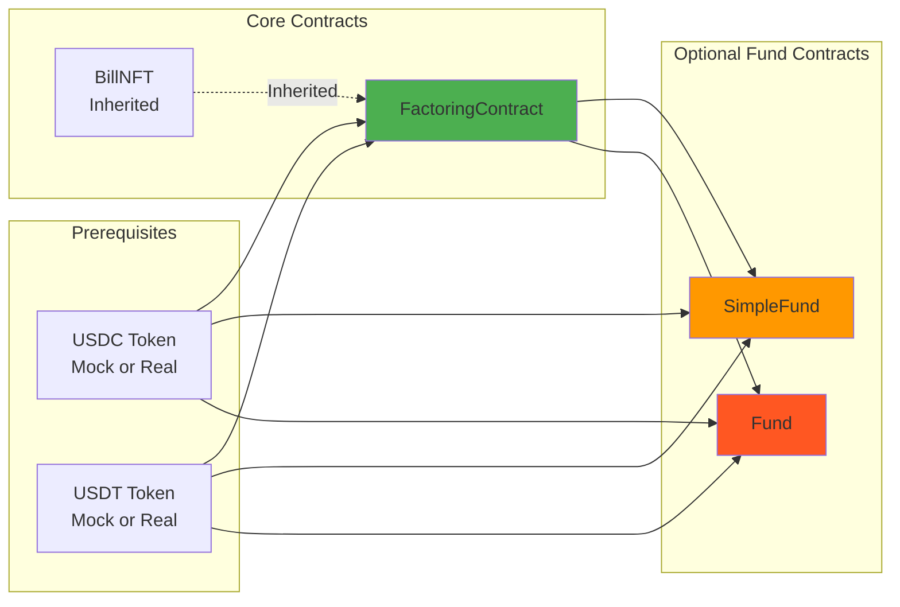

## Pre-Deployment Checklist

### Security Checklist

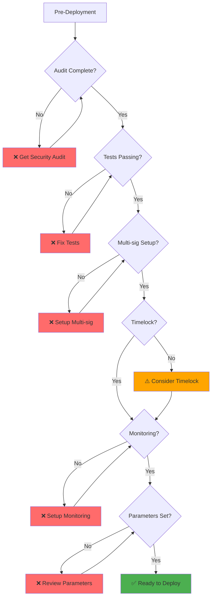

### Environment Setup

```bash
# 1. Install dependencies
npm install

# 2. Create .env file
cp .env.example .env

# 3. Configure environment variables
# Required variables:
# - PRIVATE_KEY: Deployer private key
# - INFURA_API_KEY: For network access (testnet/mainnet)
# - ETHERSCAN_API_KEY: For contract verification

# 4. Compile contracts
npm run compile

# 5. Run tests
npm test

# 6. Run security checks
npm run slither  # If slither is configured
```

### Parameter Configuration

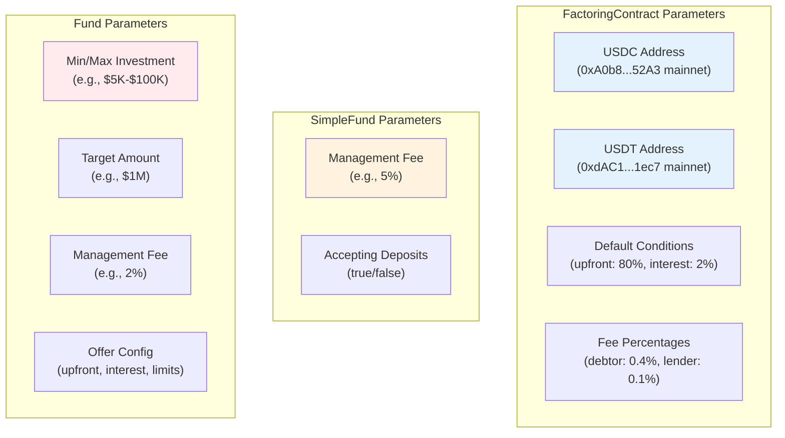

## Network Configurations

### Testnet Deployment (Sepolia)

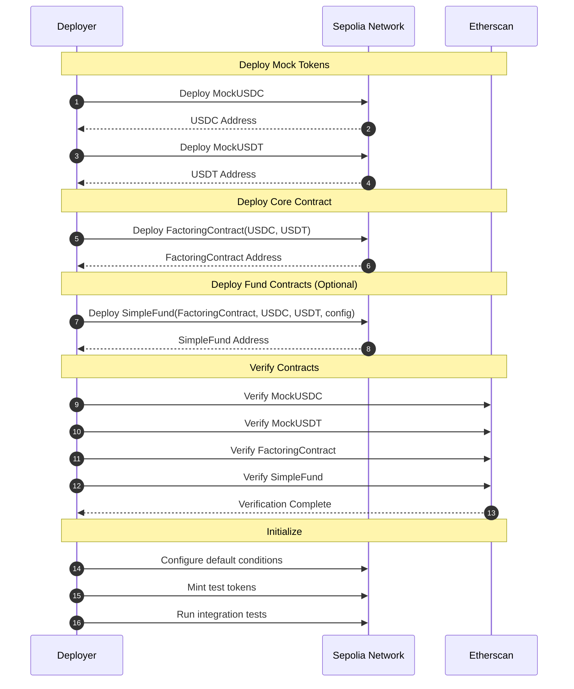

**Commands:**
```bash
# Deploy all contracts to Sepolia
./scripts/deploy.sh sepolia all

# Or deploy individually
npx hardhat ignition deploy ignition/modules/testnet/FactoringModule.ts \
  --network sepolia \
  --parameters ignition/parameters/testnet.json

# Verify on Etherscan
npx hardhat verify --network sepolia <CONTRACT_ADDRESS> <CONSTRUCTOR_ARGS>
```

### Mainnet Deployment

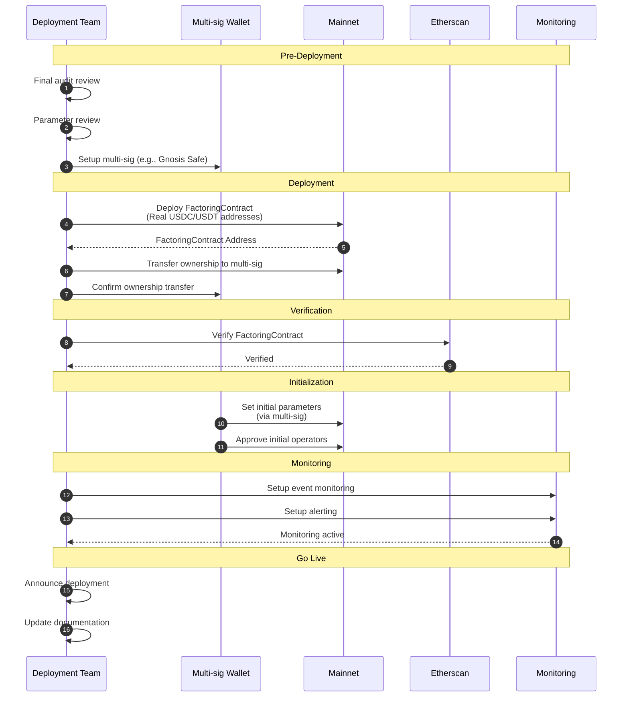

**Real Token Addresses:**

| Network | USDC | USDT |
|---------|------|------|
| Ethereum Mainnet | `0xA0b86991c6218b36c1d19D4a2e9Eb0cE3606eB48` | `0xdAC17F958D2ee523a2206206994597C13D831ec7` |
| Sepolia Testnet | Deploy Mock | Deploy Mock |
| Local | Deploy Mock | Deploy Mock |

**Commands:**
```bash
# IMPORTANT: Review all parameters before mainnet deployment!

# Deploy to mainnet (requires confirmation)
./scripts/deploy.sh mainnet factoring

# Or use Hardhat Ignition
npx hardhat ignition deploy ignition/modules/mainnet/FactoringModule.ts \
  --network mainnet \
  --parameters ignition/parameters/mainnet.json \
  --verify
```

## Deployment Strategies

### Strategy 1: Minimal Deployment

For testing or single-contract deployments:

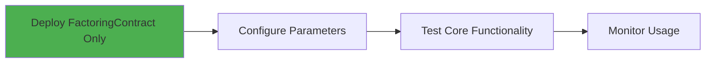

**Use Case:** Development, testing, or when only direct debtor-lender interactions are needed.

### Strategy 2: SimpleFund Deployment

For solo investor or managed fund operations:

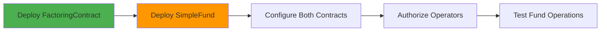

**Use Case:** Single investor or fund manager wants automated offer creation and management.

### Strategy 3: Full Deployment

For complete ecosystem with multiple investment options:

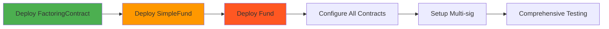

**Use Case:** Production environment with multiple investor types and pooled funds.

### Strategy 4: Phased Rollout

For gradual production deployment:

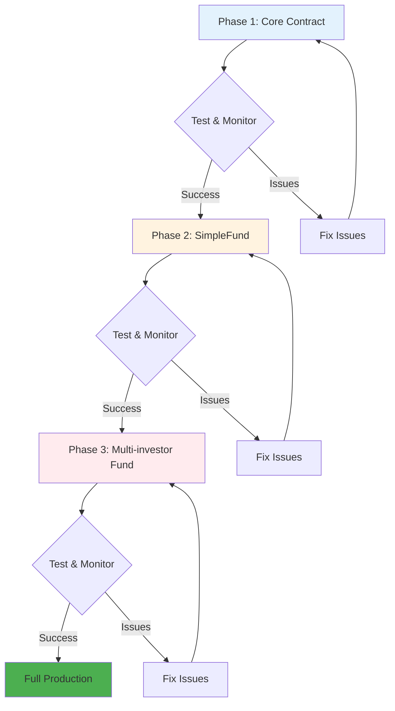

## Post-Deployment Verification

### Verification Checklist

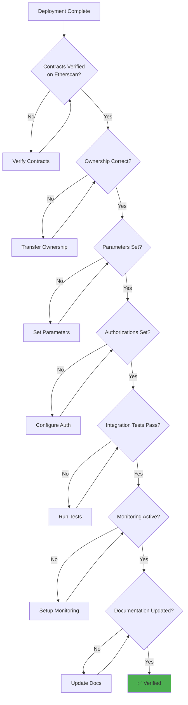

### Integration Tests

Run comprehensive integration tests after deployment:

```bash
# Set deployed contract addresses in test configuration
export FACTORING_CONTRACT_ADDRESS="0x..."
export SIMPLE_FUND_ADDRESS="0x..."

# Run integration tests
npx hardhat test --network <network> --grep "Integration"

# Test specific workflows
npx hardhat test test/integration/full-workflow.test.ts --network <network>
```

### Smoke Tests

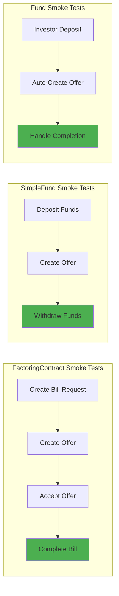

## Troubleshooting

### Common Issues

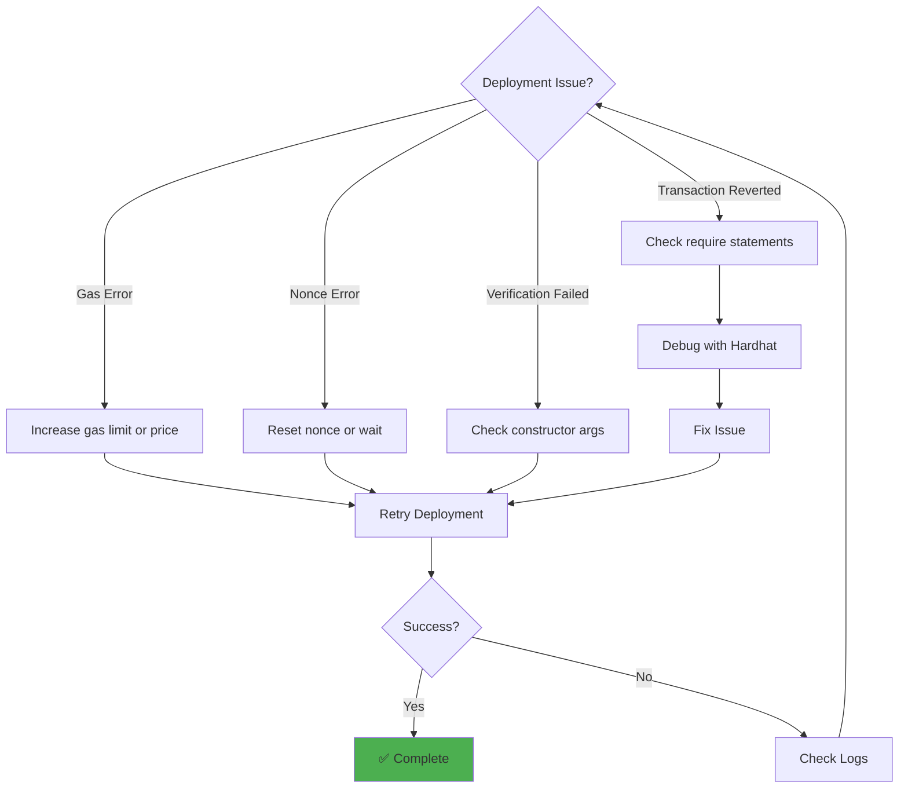

### Gas Estimation Issues

If deployment fails due to gas:

```bash
# Check estimated gas
npx hardhat run scripts/estimate-gas.js --network <network>

# Deploy with manual gas settings
npx hardhat ignition deploy <module> \
  --network <network> \
  --gas-price 50000000000 \
  --gas-limit 10000000
```

### Verification Issues

If Etherscan verification fails:

```bash
# Manual verification with constructor args
npx hardhat verify --network <network> \
  --constructor-args scripts/constructor-args.js \
  <CONTRACT_ADDRESS>

# Flatten contract for manual verification
npx hardhat flatten contracts/FactoringContract.sol > FactoringContract_flat.sol
```

### Network Connection Issues

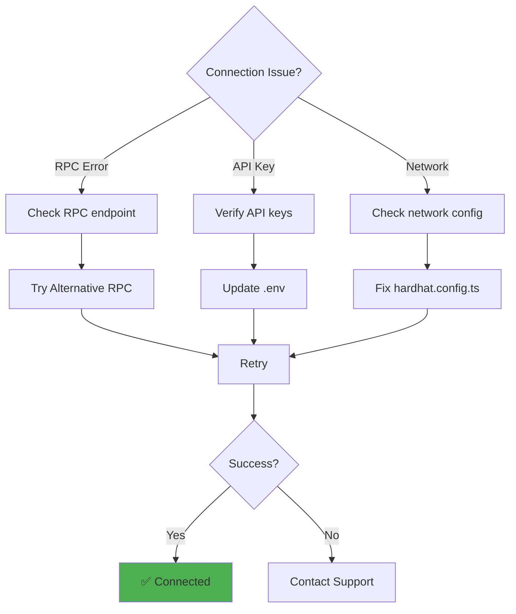

## Monitoring & Maintenance

### Post-Deployment Monitoring

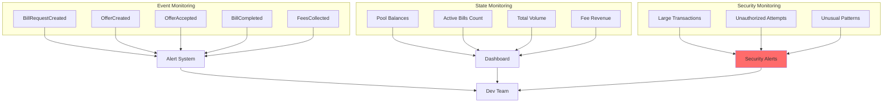

### Recommended Tools

- **Tenderly**: Transaction monitoring and debugging
- **Defender**: Automated operations and monitoring (OpenZeppelin)
- **The Graph**: Indexed event data and analytics
- **Dune Analytics**: Custom dashboards and queries

### Upgrade Considerations

Since contracts are not upgradeable, consider:

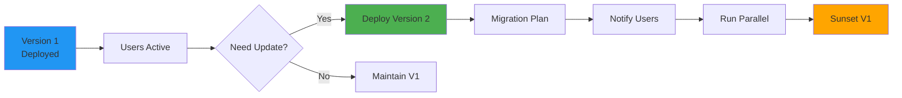

## Conclusion

Successful deployment requires:
1. ✅ Thorough testing on testnet
2. ✅ Security audit completion
3. ✅ Multi-sig setup for mainnet
4. ✅ Comprehensive monitoring
5. ✅ Clear upgrade/migration path
6. ✅ Documentation for users and developers

Always prioritize security and user safety over speed of deployment.
