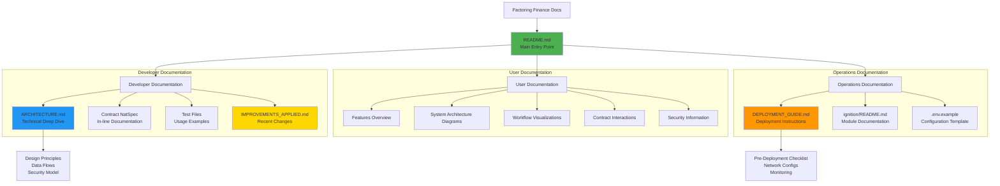
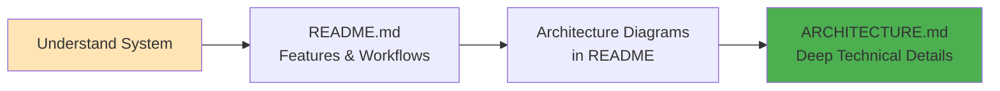
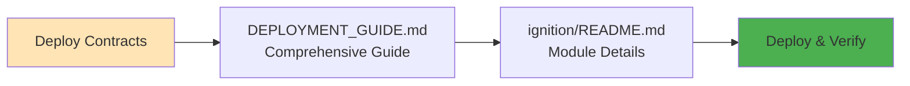
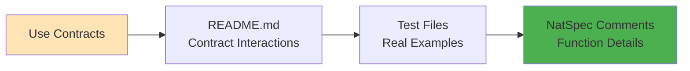
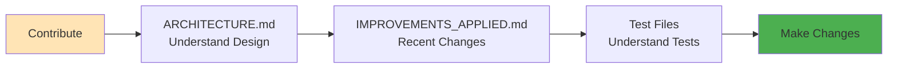
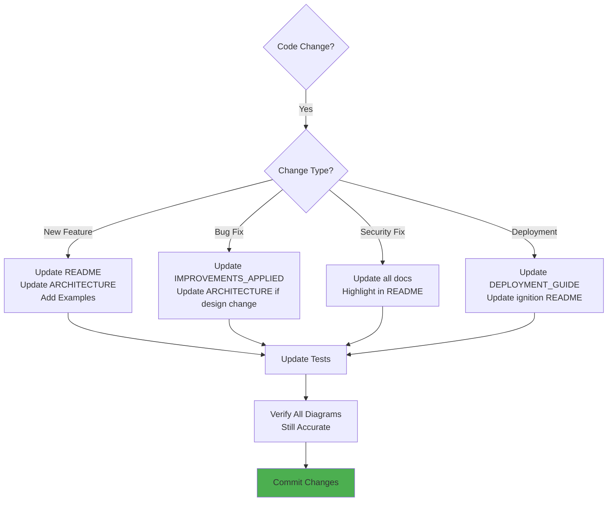

# Documentation Overview

Visual guide to all documentation in the Factoring Finance Smart Contract project.

## 📚 Documentation Map

## 📖 Documentation Files

### Core Documentation

| File | Purpose | Audience | Key Content |
|------|---------|----------|-------------|
| **README.md** | Main entry point | All users | Features, quick start, workflows, examples |
| **ARCHITECTURE.md** | Technical design | Developers | System design, data flows, security model |
| **DEPLOYMENT_GUIDE.md** | Deployment instructions | DevOps | Network configs, strategies, verification |
| **IMPROVEMENTS_APPLIED.md** | Recent changes | Developers | Security fixes, new features, test results |

### Supporting Documentation

| File | Purpose | Content |
|------|---------|---------|
| **PROJECT_SUMMARY.md** | Project overview | Status, features, next steps |
| **.github/copilot-instructions.md** | AI assistant context | Project context for Copilot |
| **ignition/README.md** | Deployment modules | Module-specific deployment docs |
| **docs/DEPLOYMENT_MODULES.md** | Legacy deployment | Old deployment documentation |
| **docs/MODULES_OVERVIEW.md** | Module overview | Ignition module descriptions |

## 🎯 Documentation by Use Case

### "I want to understand the system"

**Path:**
1. Start with [README.md](../README.md) - Features and workflows
2. Review architecture diagrams for visual understanding
3. Deep dive into [ARCHITECTURE.md](ARCHITECTURE.md) for implementation details

### "I want to deploy the contracts"

**Path:**
1. Read [DEPLOYMENT_GUIDE.md](DEPLOYMENT_GUIDE.md) - Complete deployment process
2. Check [ignition/README.md](../ignition/README.md) - Module-specific details
3. Follow pre-deployment checklist and deploy

### "I want to use the contracts"

**Path:**
1. Review [README.md](../README.md) - Contract Interactions section
2. Study test files in `test/` - See real usage patterns
3. Read contract NatSpec comments - Function-level documentation

### "I want to contribute"

**Path:**
1. Understand system design in [ARCHITECTURE.md](ARCHITECTURE.md)
2. Review [IMPROVEMENTS_APPLIED.md](../IMPROVEMENTS_APPLIED.md) for recent work
3. Study test patterns in `test/` directory
4. Make contributions with comprehensive tests

## 📊 Visual Documentation Index

### Diagrams in README.md

| Diagram Type | Count | Topics Covered |
|--------------|-------|----------------|
| Architecture | 3 | High-level system, component interaction, contract hierarchy |
| Workflow | 6 | Bill lifecycle, offer lifecycle, completion flow, interest calculation |
| Security | 2 | Validation layers, fee distribution |
| Interaction | 1 | Contract interaction examples |
| Data | 1 | Entity relationship diagram |
| Constants | 1 | System limits and defaults |

### Diagrams in ARCHITECTURE.md

| Diagram Type | Count | Topics Covered |
|--------------|-------|----------------|
| System Design | 3 | Core components, three-tier architecture, separation of concerns |
| Security | 3 | Defense in depth, reentrancy protection, pausable circuit breaker |
| Data Flow | 2 | Bill request to completion, fund operations |
| State Management | 3 | Bill states, offer states, fund balance states |
| Optimization | 3 | Storage patterns, interest calculation, array management |
| Inheritance | 1 | Contract hierarchy tree |

### Diagrams in DEPLOYMENT_GUIDE.md

| Diagram Type | Count | Topics Covered |
|--------------|-------|----------------|
| Deployment Flow | 1 | Complete deployment process |
| Dependencies | 1 | Contract dependencies |
| Checklists | 1 | Security pre-deployment checklist |
| Strategies | 4 | Minimal, SimpleFund, Full, Phased deployments |
| Verification | 1 | Post-deployment verification |
| Monitoring | 1 | Event and state monitoring |

**Total Diagrams:** 35+ mermaid diagrams across all documentation

## 🔍 Finding Information

### Quick Reference Guide

Need to find... | Check... | Section/File |
----------------|----------|--------------|
**How to create a bill request** | README.md | Contract Interactions → For Bill Owners |
**Interest calculation formula** | README.md or ARCHITECTURE.md | Workflow Diagrams → Interest Calculation |
**Security measures** | README.md | Security Considerations |
**Deployment steps** | DEPLOYMENT_GUIDE.md | Deployment Strategies |
**System design decisions** | ARCHITECTURE.md | Design Principles |
**Recent improvements** | IMPROVEMENTS_APPLIED.md | Critical Fixes Applied |
**Contract constants** | README.md or contracts | System Constants & Limits |
**Gas costs** | README.md | Gas Optimization section |
**Test examples** | test/ directory | Various test files |
**Deployment configs** | ignition/parameters/ | JSON configuration files |

## 🎨 Documentation Standards

All documentation in this project follows these standards:

### Visual Aids
- ✅ Mermaid diagrams for complex flows
- ✅ Tables for structured data
- ✅ Code blocks with syntax highlighting
- ✅ Emoji for visual categorization
- ✅ Consistent color schemes in diagrams

### Structure
- ✅ Clear table of contents
- ✅ Progressive disclosure (simple → complex)
- ✅ Cross-references between documents
- ✅ Consistent heading hierarchy
- ✅ Scannable sections with visual breaks

### Content Quality
- ✅ Technical accuracy
- ✅ Beginner-friendly explanations
- ✅ Real-world examples
- ✅ Security considerations highlighted
- ✅ Troubleshooting guides included

## 🚀 Keeping Documentation Updated

### When to Update Documentation

### Documentation Maintenance Checklist

- [ ] README.md reflects current features
- [ ] Architecture diagrams match implementation
- [ ] Deployment guide has correct addresses/configs
- [ ] All mermaid diagrams render correctly
- [ ] Code examples are tested and work
- [ ] NatSpec comments are up to date
- [ ] Recent changes documented in IMPROVEMENTS_APPLIED.md

## 📞 Documentation Feedback

Found an issue with the documentation?

1. **Unclear explanation**: Create an issue with the "documentation" label
2. **Missing information**: Submit a PR with the addition
3. **Broken diagram**: Report in issues with diagram code
4. **Outdated content**: Create an issue referencing the section

**Goal:** Keep documentation as polished as the code!

---

*Last Updated: January 5, 2026*
*Documentation Coverage: ~95% of project features*
*Total Diagrams: 35+*
*Total Pages: 50+ (across all files)*
