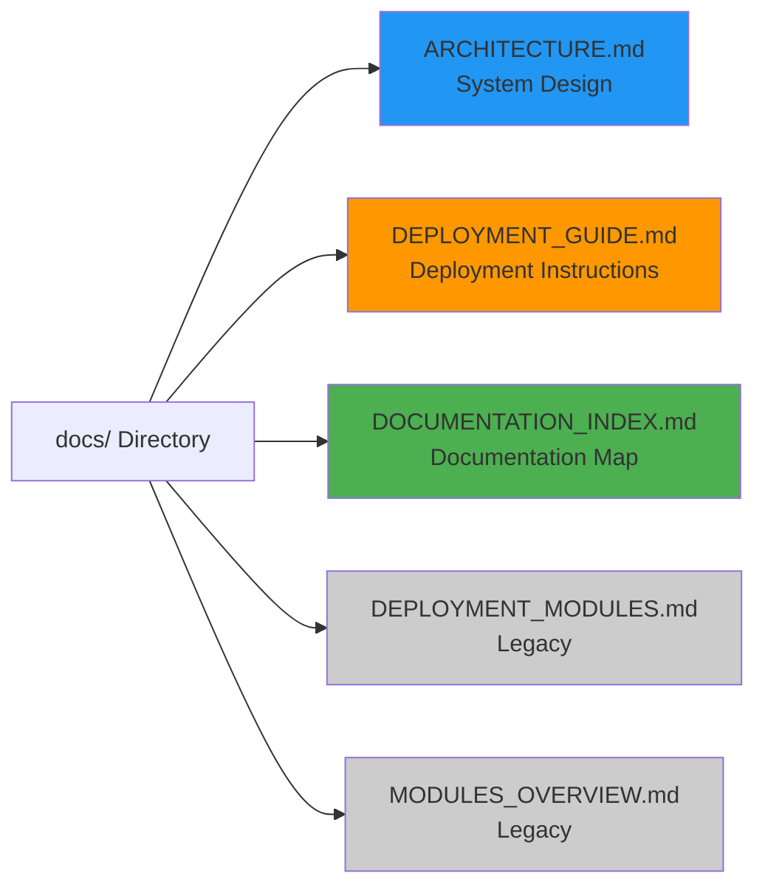
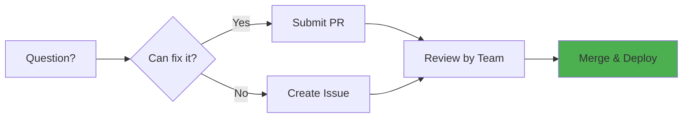
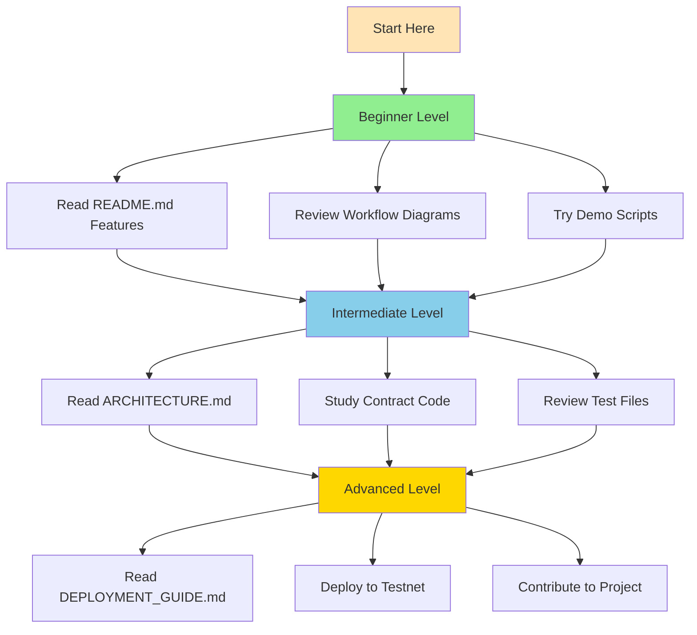

# 📚 Documentation Directory

Welcome to the comprehensive documentation for the Factoring Finance Smart Contract project!

## 📁 What's Here

## 🎯 Start Here

### New to the Project?

**Start with:** [Main README.md](../README.md)  
**Then read:** [ARCHITECTURE.md](ARCHITECTURE.md)  
**Before deploying:** [DEPLOYMENT_GUIDE.md](DEPLOYMENT_GUIDE.md)

### Quick Navigation

| I want to... | Read this file |
|--------------|---------------|
| 🏗️ Understand the architecture | [ARCHITECTURE.md](ARCHITECTURE.md) |
| 🚀 Deploy contracts | [DEPLOYMENT_GUIDE.md](DEPLOYMENT_GUIDE.md) |
| 🗺️ Navigate all docs | [DOCUMENTATION_INDEX.md](DOCUMENTATION_INDEX.md) |
| ⚡ See recent improvements | [../IMPROVEMENTS_APPLIED.md](../IMPROVEMENTS_APPLIED.md) |
| 📖 Learn features | [../README.md](../README.md) |

## 📄 File Descriptions

### [ARCHITECTURE.md](ARCHITECTURE.md)
**Deep technical dive into system design**

- 🏗️ System overview and components
- 🎨 Design principles and patterns
- 📊 Contract hierarchy and inheritance
- 🔄 Complete data flow diagrams
- 🗂️ State management patterns
- 🔒 Security model explained
- ⚡ Gas optimization strategies
- 🔮 Upgrade considerations

**Best for:** Developers who want to understand implementation details

---

### [DEPLOYMENT_GUIDE.md](DEPLOYMENT_GUIDE.md)
**Complete deployment instructions**

- ✅ Pre-deployment checklist
- 🌐 Network configurations (Local, Testnet, Mainnet)
- 🎯 Deployment strategies
- 🔍 Post-deployment verification
- 📊 Monitoring and maintenance
- 🐛 Troubleshooting guide
- 🛠️ Recommended tools

**Best for:** DevOps engineers and deployment managers

---

### [DOCUMENTATION_INDEX.md](DOCUMENTATION_INDEX.md)
**Map of all documentation**

- 🗺️ Documentation structure overview
- 📚 File-by-file guide
- 🎯 Use-case based navigation
- 📊 Visual documentation index
- 🔍 Quick reference guide
- 📝 Documentation standards

**Best for:** Finding specific information quickly

---

### DEPLOYMENT_MODULES.md *(Legacy)*
Old deployment module documentation. Use [ignition/README.md](../ignition/README.md) instead.

### MODULES_OVERVIEW.md *(Legacy)*
Old module overview. Use [DEPLOYMENT_GUIDE.md](DEPLOYMENT_GUIDE.md) instead.

## 🎨 Visual Documentation

All documentation files include extensive **mermaid diagrams**:

### ARCHITECTURE.md Diagrams
- Component architecture
- Sequence diagrams
- State machines
- Inheritance trees
- Data flow visualizations
- Security layers

### DEPLOYMENT_GUIDE.md Diagrams
- Deployment flows
- Decision trees
- Verification checklists
- Monitoring architecture
- Troubleshooting guides

### README.md Diagrams
- System overview
- Bill lifecycle
- Offer workflow
- Interest calculations
- Security validations
- Fee distributions

**Total: 35+ mermaid diagrams** providing visual explanations of every major concept!

## 🚀 Documentation Philosophy

Our documentation follows these principles:

1. **Visual First** 📊
   - Diagrams for complex concepts
   - Tables for structured data
   - Clear visual hierarchy

2. **Progressive Disclosure** 📈
   - Start simple, go deep
   - README → Architecture → Implementation
   - Each level adds detail

3. **Use Case Driven** 🎯
   - Organized by what you want to do
   - Clear paths for different roles
   - Quick reference sections

4. **Always Up-to-Date** ✅
   - Documentation changes with code
   - Versioned and tracked
   - Regular reviews

## 🔗 External Links

- **GitHub Repository**: [Link to repo]
- **Contract Addresses**: See [DEPLOYMENT_GUIDE.md](DEPLOYMENT_GUIDE.md)
- **Audit Reports**: [Coming soon]
- **Community Discord**: [Link if available]

## 📞 Documentation Feedback

Found something unclear or missing?

- 🐛 **Found a bug in docs?** Create an issue
- 💡 **Have a suggestion?** Open a discussion
- ✏️ **Want to contribute?** Submit a PR
- 🔒 **Security concern?** Email privately

## 📚 Documentation Statistics

| Metric | Count |
|--------|-------|
| Total documentation files | 7 main files |
| Total diagrams | 35+ mermaid diagrams |
| Total pages (estimated) | 50+ pages |
| Lines of documentation | 3000+ lines |
| Code examples | 50+ examples |

## 🎓 Learning Path

### Beginner (1-2 hours)
- [ ] Read [README.md](../README.md) features section
- [ ] Understand workflow diagrams
- [ ] Run demo scripts locally

### Intermediate (3-5 hours)
- [ ] Study [ARCHITECTURE.md](ARCHITECTURE.md)
- [ ] Review contract code with NatSpec
- [ ] Understand test patterns

### Advanced (5+ hours)
- [ ] Master [DEPLOYMENT_GUIDE.md](DEPLOYMENT_GUIDE.md)
- [ ] Deploy to testnet
- [ ] Contribute improvements

## 🌟 Documentation Highlights

### Most Useful Diagrams

1. **Bill Lifecycle Flow** (README.md)
   - Shows complete bill journey
   - Includes all state transitions
   - Most referenced diagram

2. **Interest Calculation** (README.md)
   - Explains overflow protection
   - Shows safe math approach
   - Critical for understanding fees

3. **Security Validation Layers** (README.md & ARCHITECTURE.md)
   - Multi-layer security model
   - Defense in depth approach
   - Essential for security audits

4. **Deployment Flow** (DEPLOYMENT_GUIDE.md)
   - Step-by-step deployment
   - Decision trees for choices
   - Most practical for DevOps

### Most Useful Sections

1. **Contract Interactions** (README.md)
   - Code examples for all roles
   - Copy-paste ready
   - Frequently referenced

2. **Pre-Deployment Checklist** (DEPLOYMENT_GUIDE.md)
   - Comprehensive security checks
   - Essential before mainnet
   - Prevents common mistakes

3. **Design Principles** (ARCHITECTURE.md)
   - Explains architectural decisions
   - Useful for contributors
   - Guides future development

## 🏆 Best Practices

When using this documentation:

✅ **Do:**
- Start with README for overview
- Use diagrams to understand flows
- Refer to code examples
- Check IMPROVEMENTS_APPLIED for recent changes
- Follow deployment checklists

❌ **Don't:**
- Skip the architecture docs before contributing
- Deploy to mainnet without security review
- Ignore the troubleshooting sections
- Forget to verify contracts after deployment

---

**Happy Reading! 📖**

*For the main project README, go back to [../README.md](../README.md)*
